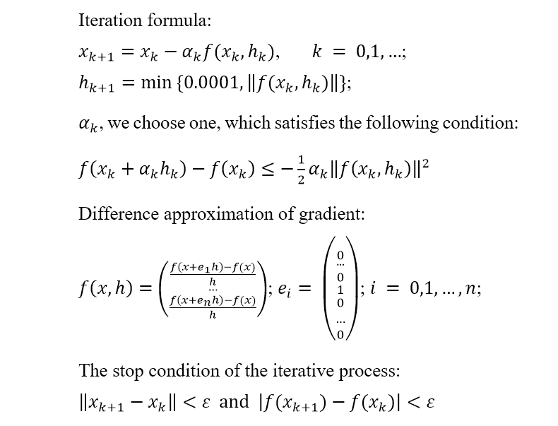
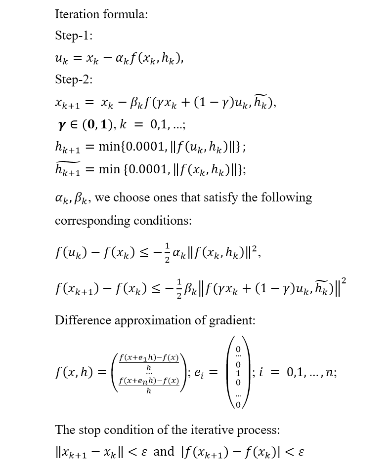
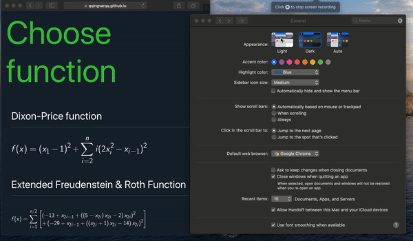

# [Gradient Methods App](https://qqingvarqq.github.io/gradient-methods-app/#/)
The purpose of this app is the ability to compare the performance of the difference-gradient method and two-step modification of the difference-gradient method on different unconstrained optimization problems.

## Difference-gradient method

The main difference between the regular gradient method and the difference-gradient method is that instead of using derivatives in the explicit form we use an approximation of finite differences.

## Two-step difference-gradient method

Here we calculate the next iteration based on two steps, which allows us to chose direction in which we moved more precisely.

------
### App Light/Dark modes.

Almost every os now supports dark mode, so this app will automatically set the corresponding theme to your os preferences.

